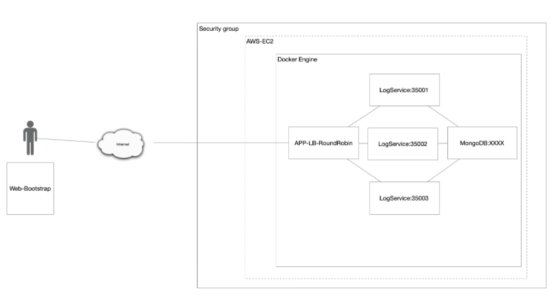
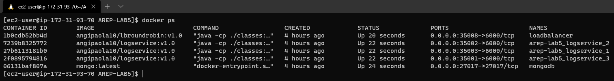

# Laboratorio 5 - Docker and AWS

## Getting started
### Prerequisites
* Git
* Maven
* Java SE Development Kit 8
* Java SE Runtime Environment 8
* Docker
    ### Images
    * [Log Service](https://hub.docker.com/repository/docker/angipaola10/logservice)
    * [Load Balancer Round Robin](https://hub.docker.com/repository/docker/angipaola10/lbroundrobin) 

## Build With
* [Maven](https://maven.apache.org/) - Dependency Management
* CircleCI for CI
    * Log Service:
        
    * Load Balancer:
        

## Deployment
This project was uploaded to an EC2 hosted on AWS. For cost purposes the machine was deleted, but this document contains media files that show some tests.

## Architecture 
This repository contains two projects that were developed to create the [images](#Images) used to implement the next architecture:

* **MongoDB** is an instance of MongoDB running in a docker container.
* **LogService** is a REST service that receives a message, save it in the data base and return a JSON object with the 10 last messages saved.
* **APP-LB-RoundRobin** is a application composed by a web client and at least a service REST, the web client contains a field and a button. The user sends a message, it is sent to the REST service and updates the screen with the information that it returns in JSON format. The REST service receives the chain and implements a Round Robin load balancing algorithm, delegating the processing of the message and the return of the response to each of the three instances of the LogService service.

## Install and Run 
* To obtain the project developed to build the architecture purposed in your computer, you must clone this repository using the next command:

    `git clone https://github.com/angipaola10/AREP-LAB5`
    
* Verify if the command  `docker-compose` is installed

* Enter to folder `/AREP-LAB5` in the command terminal and run the next command:

    `docker-compose up -d --scale logservice=3`
    
    This command use the `docker-compose.yml` file to create the containers necessary to build the architecture. In this file are defined the images that will be download and some configurations of database instance to can connect it with other services.

* Verify that all containers are running and enter to http://localhost:35008, here you find the web client created in the load balancer.

## Test
* 5 containers in a EC2 machine of AWS: 1 with an instance of MongoDB, 3 with an instance of LogService and 1 with an instance of loadbalancer.

* Add and show messages in the web client of the load balancer:

* Instances of LogServices run in the ports 35001, 35002 and 35003:

## Documentation
This repository contains a [paper](/Document.pdf) that describes the proccess performed to make the program, but if you need aditional iformation in the directory [/LogService/docs](/LogService/docs) or [/LBRoundRobin/docs](/LBRoundRobin/docs) you find the documentation of site. 

### Instructions 
If you want generate the documentation of a program, you must follow the next steps:
1. Run the next command to create the documentation:

       mvn javadoc:javadoc
       
2. Now, if you want, you can generate a site to see the documentation. Use the next command: 

       mvn site
       
3. To see the site created, you must run the next command:

       mvn site:run
       
    Enter http://localhost:8080 in your browser to see the site with the documentation.

## Author
* Angi Paola Jiménez Pira - Student at the *Colombian School of Engineering Julio Garavito.*

## License
This project is licensed under the GNU v3.0 - see the [LICENSE.md](LICENSE.md) file for details